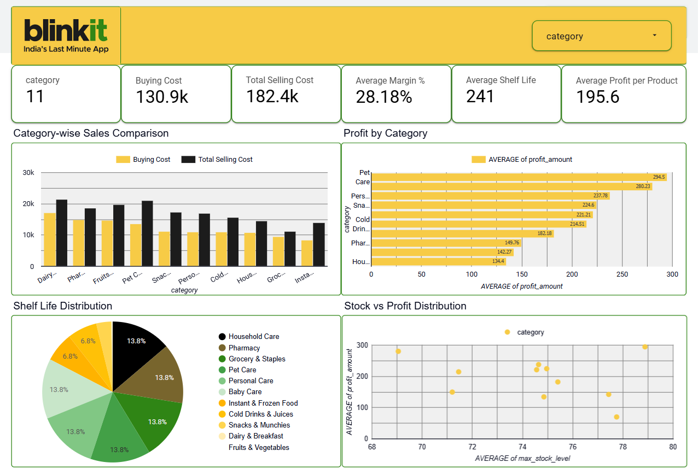

# 🛒 Blinkit Sales & Inventory Analysis Dashboard

---

## Project Overview
This project analyzes Blinkit's product dataset to understand **sales performance, profit trends, and inventory behavior across different categories**.

The analysis was first performed on the **raw dataset using Looker Studio**, followed by **data cleaning, transformation, and deeper analysis using Excel (Pivot Tables & Calculations)**.

---

## Project Files

### Raw Data
- **Blinkit Data.xlsx** – Original dataset before any processing.
### Cleaned Dataset
- **Cleaned_Blinkit_Dataset.xlsx** – Dataset after preprocessing and cleaning.
### Pivot Table and Calculation
- **Pivot Table 1.pdf** – Contains pivot tables and calculated metrics used for insights.
### Dashboard
- **Blinkit_Data_Analysis_Pivot_Table_1.pdf** – PDF of the final dashboard created for analysis.
### logo.png
- **Image of Blinkit logo.**

---

## Data Cleaning Process
The raw dataset was cleaned to ensure accuracy and consistency:
- Removed missing and inconsistent values  
- Standardized column formats (price, margin, etc.)  
- Verified calculated fields:
  - **Profit = MRP - Price**
  - **Margin % = (Profit / MRP) × 100**
- Categorized products properly (e.g., Baby Care, Snacks, Dairy)

---

## 📊 Data Analysis (Excel)
Using Excel:
- Created **Pivot Tables** for category-wise analysis  
- Calculated:
  - Total Buying Cost  
  - Total Selling Cost
  - Average Buying Cost
  - Average Selling Cost
  - Average of Margin %  
  - Average of Shelf Life Days
  - Average of min Stock Level
  - Average of max Stock Level
  - Average of Profit

---
## Dashboard Preview

## Dashboard Insights

### KPI Metrics
- **Total Categories:** 11
- **Total Buying Cost:** 130.9K  
- **Total Selling Cost:** 182.4K  
- **Average Margin %:** 28.18%  
- **Average Shelf Life:** 241 days  
- **Average Profit per Product:** 195.6  

---

### Key Visualizations
- **Category-wise Sales Comparison**  
  → Compare Buying vs Selling cost  

- **Profit by Category**  
  → Identify most profitable categories (e.g., Pet Care, Personal Care)  

- **Shelf Life Distribution**  
  → Understand product longevity across categories  

- **Stock vs Profit Analysis**  
  → Relationship between stock levels and profitability  

---

## Key Insights
- 📈 **Pet Care & Personal Care** generate the highest profit  
- 🥦 **Fruits & Vegetables** have low shelf life but stable sales  
- 📦 Higher stock levels do not always guarantee higher profit  
- 🧴 Categories like **Household Care** maintain balanced margins  

---

## Tools Used
- **Excel** → Data cleaning, formulas, pivot tables  
- **Looker Studio** → Initial dashboard (using Pivot table)  
- **GitHub** → Version control & project sharing  

---

## How to Use
1. Download the dataset from the repository  
2. Open the cleaned dataset in Excel  
3. Explore pivot tables and calculations  
4. View dashboard for insights  

---

## Author
**Pallabi Biswas**  
- Btech CSE
- **Contact:** pallabibiswas4002@gmail.com
---
